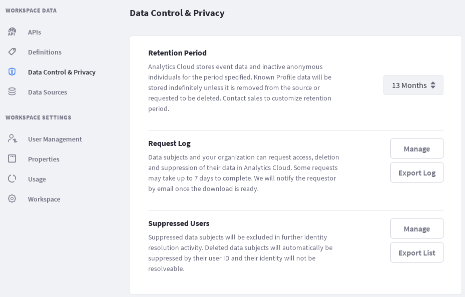
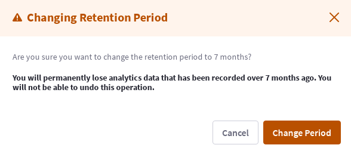
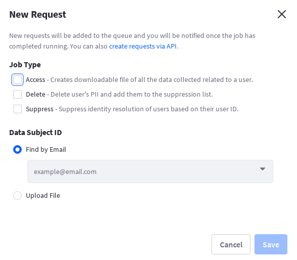
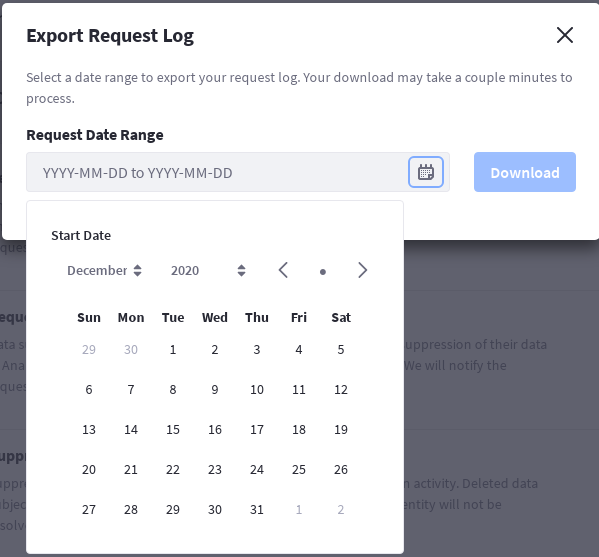
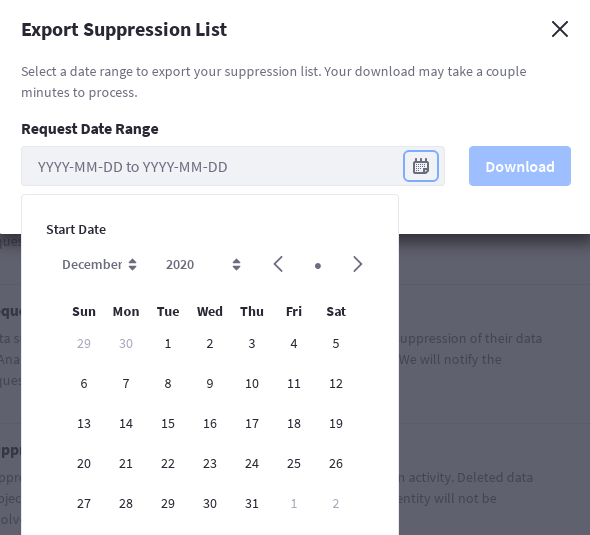

# Data Control and Privacy

Analytics Cloud provides different administrative tools for managing individual data and privacy. To access the tools, click &rarr; *Settings* &rarr; *Data Control & Privacy*.



## Retention Period

By default, event data and inactive anonymous individuals are retained for 13 months. To change the retention period from 13 months to 7 months,

1. Use the drop-down menu to select 7 months.

    

1. A warning window will pop-up to confirm your change.

1. Click *Change Period *to save.

```Warning
You will permanently lose analytics data that has been recorded over 7 months ago when you make this change.
```

## Request Log

Manage and control collected data of individuals with this tool. New requests can be made to access individual data, delete individual data, or suppress individual data. For example, an individual may contact you requesting data collected on them to be shared or to be deleted.

To create a new request or view previous requests, click the *Manage* button.


A log of previous requests is presented. Use the filter function or search function to find a particular request. To download a ZIP file of a request, click the *Download* button of the request. 

To create a new request,

1. Click the *Create Request* button.

    

1. Select the Job Type. Selecting Access creates a downloadable file of all data collected related to the individual. Selecting Delete removes all Personally Identifiable Information (PII) of an individual and places them on the suppressed list. Selecting Suppress stops further data collection of the individual.

1. Input an email for the new request. A list of emails in a CSV file can also be uploaded.

1. Click *Save* and the request will be processed. 

A log of previous requests can be downloaded by clicking on the *Export Log* button on the main page.



Select a start date and an end date and click the *Download* button for a CSV log file.

## Suppressed Users

Suppressing a user stops further data collection of an individual. To view a list of suppressed individuals or to unsuppress an individual, click the *Manage* button.


Search the list of suppressed individuals by inputting a particular email address. 

To unsuppress, locate the individual and click the *Unsuppress* button.

A list of suppressed individuals can be downloaded by clicking on the *Export List* button on the main page.



Select a start date and an end date and click the *Download* button for a CSV list file.