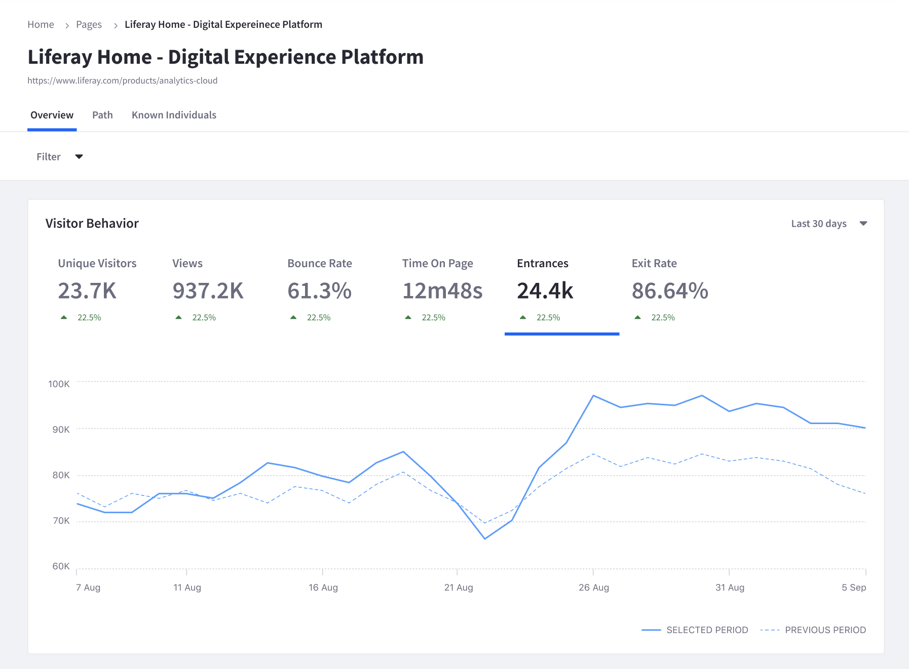
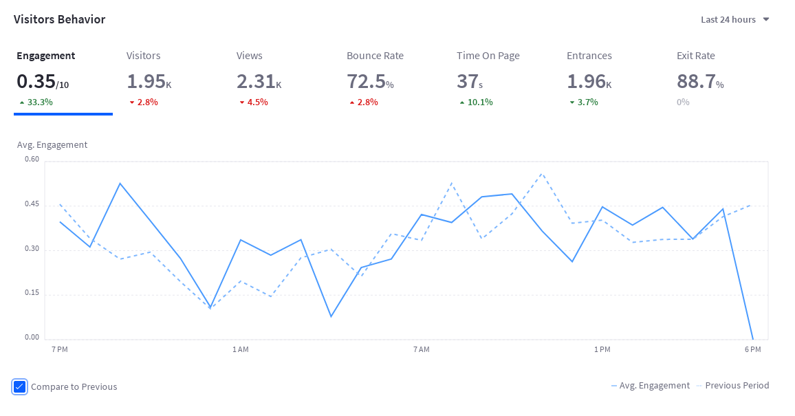

# Touchpoints Analytics Data

Touchpoints reflect the many different ways your users and customers interact with your brand. Analytics Cloud presents a broad range of analytics data that combines traditional page analytics like page views, with comprehensive site, path, and asset-specific analytics data.

Analytics Cloud's presents site-wide reporting that provides a comprehensive report of your entire site. This helps you understand how many unique visitors your site has over time, which pages these visitors access, what their interests are, and more. Analytics for individual pages can be easily viewed as well. This includes views, visitors, and bounce rate. Path analytics let you see how visitors arrive at your pages. This includes information on which pages they visit prior to yours, and their location and device type. Finally, you can also track the performance of many Liferay DXP Assets to drill deeper than the page level to determine how you can improve your site's performance.

Here, you'll learn how to find the site, page, and asset analytics:

* [Site Report](#site-report)
* [Viewing Page Data](#viewing-page-data)
* [Finding Asset Data](#finding-asset-data)

The rest of the articles in this section explain these metrics in detail.


## Site Report

Liferay Analytics Cloud provides a single Site report for each connected data source. For example, if you connect Analytics Cloud to one DXP instance and configure analytics for two subsites, one Site report aggregating both subsites is created.

Follow these steps to view the Site report:

1. In the Touchpoints section of the menu, click Sites.

1. Click the Overview tab (this tab is selected by default when you click Sites). This tab contains the Site report.

The Site report contains the following data:

* [Site Metrics](#site-metrics)
* [Top Pages](#top-pages)
* [Acquisitions](#acquisitions)
* [Visitors by Day and Time](#visitors-by-day-and-time)
* [Search Terms and Interests](#search-terms-and-interests)
* [Sessions by Location](#sessions-by-location)
* [Session Technology](#session-technology)
* [Cohort Analysis](#cohort-analysis)

### Site Metrics

The Site Metrics panel presents a summary of how visitors interact with your Site. This panel contains the following metrics:

* **Visitors:** Total unique visitors.
* **Sessions per Visitor:** An average of the number of sessions for each unique visitor. A single user can open multiple sessions. A session ends after 30 minutes of inactivity, or at midnight.
* **Session Duration:** The length of time an average session lasts.
* **Bounce Rate:** The percentage of visitors who view your Site's first page, but do nothing else before the session ends.
* **Engagement:** A proprietary metric that Analytics Cloud calculates to determine how engaged a visitor is with your Site. This is derived from session duration, pages visited, scroll depth, time on page, and more.

Clicking each metric changes the visualization in the panel to display the selected metric.


### Top Pages

The Top Pages panel lists the following:

* **Visited Pages:** Your Site's most visited pages and the number of visitors for each.
* **Entrance Pages:** The most common pages that visitors view first upon entering your Site, and the number of entrances for each.
* **Exit Pages:** The most common pages that visitors view when leaving your Site, and the exit percentage for each. The exit percentage is the percentage of visitors for which the page is the last page in their session.

To view more detailed page analytics, click View Pages in the panel. Alternatively, click the Pages tab at the top of the screen. Both take you to the page analytics discussed in [Viewing Page Data](#viewing-page-data).



## Acquisitions

The Acquisitions panel shows how visitors arrive to your Site. It shows data for the channels, source/medium, and referrers from which visitors arrive to your Site.

This report works best if your marketing campaign utilizes UTM parameters. UTM parameters allow Analytics Cloud to determine where visitors arrive from (e.g., the specific referrer or ad campaign).


### Visitors by Day and Time

The Visitors by Day and Time panel visualizes the days and times when visitors come to your Site. This helps you understand when your Site is most active. You can use this information, for example, to know when to release important information or launch an advertising campaign.

The panel contains a grid with the days of the week on one axis, and the time of day on the other axis. Darker cells in the grid indicate heavier Site traffic at the corresponding day and time. Tooltips for each cell show the number of visitors for that day and time.


### Search Terms and Interests

The Search Terms and Interests panels show your visitors' most common search terms and the topics they're interested in, respectively. Search terms are collected from the search query parameter in your Site's URL. Interest topics are derived from the keyword metadata of the pages that visitors view. To view the full list of interest topics, click All interests in the Interests panel. Alternatively, click the Interests tab at the top of the screen.


### Sessions by Location

The Sessions by Location panel shows the countries from which visitors access your Site. Countries with more visitors are shaded darker on the map. The countries are also listed below the map along with the number and percentage of visitors for each.


### Session Technology

The Session Technology panel shows the devices, operating systems, and browsers that visitors access your Site with. Tooltips for each graph element display more detailed data for that element. On the Devices tab, for example, mouse over each bar on the bar graph to see the operating system data for that device.


### Cohort Analysis

The Cohort Analysis panel shows a [cohort analysis](https://en.wikipedia.org/wiki/Cohort_analysis) based on visitors from a specific acquisition date (the cohort) and whether they return to your Site over a given time period. Use the selector menus at the top left of the panel to select the visitor type (All, Anonymous, or Known) and time period (Day, Week, or Month).

For example, if you select All Visitors and Day, the percentage of visitors from a given acquisition date that return to your Site are listed in the chart for each following day.


## Viewing Page Data

Follow these steps to view the list of Pages with summary data:

1. Find the Touchpoints section of the menu.
1. Click Sites.
1. Click the Pages tab.


Order Pages in ascending or descending order based on any one of these metrics. Click the metric's heading in the table to perform the sort:

* Average Engagement Score
* Total Visitors
* Total Views
* Average Time on Page
* Average Bounce Rate
* Entrances
* Exit Rate

The metrics for ordering the Page list are calculated based on the time period selected in the time period menu (at the top-right of the table). The following values are supported:

* Last 24 hours
* Yesterday
* Last 7 days
* Last 28 days
* Last 30 days (default)
* Last 90 days

```Note::
Page data is based on canonical URL. Learn more about `canonicalization <https://moz.com/learn/seo/canonicalization>`_ or `how to set a custom canonical URL in DXP <https://learn.liferay.com/dxp/7.x/en/site-building/creating-pages/page-settings/configuring-individual-pages.html#seo>`_
```

To view detailed metrics for a single page, click that page in the table. See [Page Analytics](pages/pages.md) for more information.



## Finding Asset Data

1. Find the Touchpoints section of the menu.
1. Click Assets for a list of Assets with summary data.
1. Choose an Asset type: Blogs, Documents and Media, Forms, Web Content, or Custom.


To order Assets in ascending or descending order based on any one of the Asset's metrics, click the metric's heading in the table. The metrics differ between Assets. See each Asset's documentation for more information. In addition, you can calculate the metrics over a selected time period by selecting one of the following values from the time period menu (at the top-right of the table):

* Last 24 hours
* Yesterday
* Last 7 days
* Last 28 days
* Last 30 days (default)
* Last 90 days

Click an Asset in the list to see more granular detail. Remember that there are separate lists for different Asset types. More details on each Asset type's metrics are covered in the subsequent articles.


