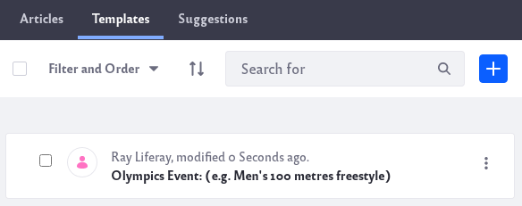
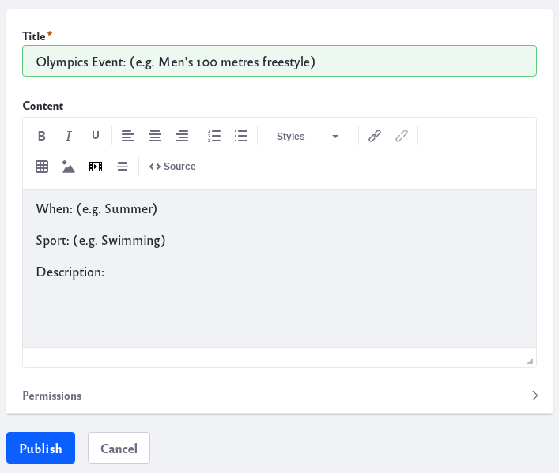

# Knowledge Base Templates

Templates give users a starting point. For example, you can create templates that contain default headers or other content for articles. Templates help foster consistent formatting and content organization for articles. You can create and manage templates from the Knowledge Base app in Site Administration. 

To navigate to the Knowledge Base app, click on the Menu icon () and navigate to *Content and Data* &rarr; *Knowledge Base*. 

<!-- Do we need a note about permissions on every article?
Note: To access Knowledge Base in Site Administration, a Role must have the permission *Knowledge Base* &rarr; Access in *Site Administration*. To add or act on articles, folders, or suggestions, the Site administrator must grant the appropriate permissions using the Permissions window in Knowledge Base. -->

## Creating Templates

To create a new template, 

1. Click the *Templates* tab.

1. Click the Add button (). This brings up the New Template form.

    

1. Enter a title for the template.

1. Use the WYSIWYG editor to create the template’s content. To view or edit the article’s HTML source, click the *Source* button (`</>`) in the editor. You can also set the template’s permissions via the form’s *Permissions* section.

1. Click *Publish* to finish creating the template.

## Managing Templates

Each template appears in a list in the Templates tab. You can take the following actions on each template via its Actions icon (),

**View:** Display the template. From here, you can print the template, use it to create an article, edit it, modify its permissions, or delete it.

**Edit:** Change the template’s title and content.

**Permissions:** Configure the template’s permissions. You can choose whether a Role can change permissions, update, view, or delete the template.

**Delete:** Remove the template from the Knowledge Base.