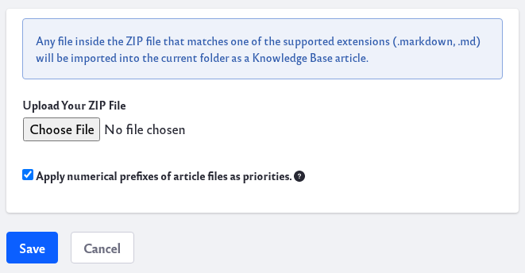

# Knowledge Base ZIP File Requirements

The Knowledge Base importer supports article hierarchies, so Markdown files can be specified anywhere in the ZIP file’s directory structure. They can be nested in any number of folders. Image files are the only files supported for attachments.

```Note: 
Imported articles are independent of the workflow settings. This means that imported articles are automatically approved.
```

<!-- Do we need a note about permissions on every article?
Only users with the Import Articles permission assigned to their Role are able to import articles. This permission can be assigned manually through Control Panel &rarr; Users &rarr; Roles. -->

The ZIP file’s articles are imported in file order (alphanumerically). To designate an article’s priority, add a numeric prefix to its file name. For example, the priorities for articles named `01-file.markdown` and `02-file.markdown` become `1.0` and `2.0`.

To designate an article to be the parent of all other articles in the same source folder, end its file name with `-intro.markdown`. This creates a parent-child hierarchy. You can use the prefix `00` for parent articles to place them at the top of the folder’s file order. The importer uses the numeric prefix of an intro file’s folder as its article priority.

Here’s the underlying logic for the `00` prefix:

* A file prefix of `00` for a non-intro file assigns the resulting article’s priority to `1.0`.
* A file prefix of `00` for a top-level intro file sets the article’s priority to the first folder numeric prefix found that is `1.0` or greater.

This convention lets you specify priorities for top-level (non-child) articles in your hierarchy.

When importing, keep the checkbox labeled *Apply numerical prefixes of article files as priorities* selected. If a file doesn’t have a prefix, its article gets the next available priority (the highest current priority, plus one).

Below is an example ZIP file structure that demonstrates the features mentioned so far:

ZIP File Structure Example:

* `01-winter-olympics/`
    * `00-winter-events-intro.markdown`
    * `01-speed-skating.markdown`
    * `02-bobsleigh.markdown`
* `02-summer-olympics/`
    * `00-summer-events-intro.markdown`
    * `01-swimming.markdown`
    * `02-gymnastics.markdown`
    * `03-track-and-field/`
        * `00-track-and-field-intro.markdown`
        * `01-marathon.markdown`
* `images/`
    * `some-image.png`
    * `another-image.jpeg`

The above ZIP file specifies `00-winter-events-intro.markdown` as the parent of its neighboring Markdown files: `01-speed-skating.markdown` and `02-bobsleigh.markdown`. Likewise, `00-track-and-field-intro.markdown` is the parent of `01-marathon.markdown`. `00-track-and-field-intro.markdown` is also the peer of `01-swimming.markdown` and `02-gymnastics.markdown`, and the child of `00-summer-events-intro.markdown`.

ZIP Example’s Resulting Relationships and Priorities:

* `01-winter-olympics/00-winter-events-intro.markdown`
    * Article: Winter Events
    * Relationship: Peer of Summer Events
    * Priority: 1.0
* `01-winter-olympics/01-speed-skating.markdown`
    * Article: Speed Skating
    * Relationship: Child of Winter Events
    * Priority: 1.0
* `01-winter-olympics/02-bobsleigh.markdown`
    * Article: Bobsleigh
    * Relationship: Child of Winter Events
    * Priority: 2.0
* `02-summer-events/00-summer-events-intro.markdown`
    * Article: Summer Events
    * Relationship: Peer of Summer Events
    * Priority: 2.0
* `02-summer-events/01-swimming.markdown`
    * Article: Swimming
    * Relationship: Child of Summer Events
    * Priority: 1.0
* `02-summer-events/02-gymnastics.markdown`
    * Article: Gymnastics
    * Relationship: Child of Summer Events
    * Priority: 2.0
* `02-summer-events/03-summer-olympics/00-track-and-field-intro.markdown`
    * Article: Track and Field
    * Relationship: Child of Summer Events
    * Priority: 3.0
* `02-summer-events/03-summer-olympics/01-marathon.markdown`
    * Article: Marathon
    * Relationship: Grandchild of Summer Events
    * Relationship: Child of Track and Field
    * Priority: 1.0

ZIP files must meet the following requirements:

* Each ZIP file must end in the suffix `.zip`.
* Each ZIP file must contain at least one Markdown source file, optionally organized in folders.
* All referenced image files must be in a folder named `images` in the ZIP file’s root.
* Image files must be in a supported format and must use the appropriate file extensions. Supported extensions are `.bmp`, `.gif`, `.jpeg`, `.jpg`, and `.png`. They’re specified via an app system setting. For details, see [Knowledge Base System Settings](knowledge-base-system-settings.md).

Once you have your article ZIP file, it’s time to import it. To import your ZIP file,

1. Click on the Menu icon () and navigate to Content and Data &rarr; Knowledge Base &rarr; Articles. 

1. Click on the Add icon () and click *Import*.

    

1. Click *Choose File* and locate the ZIP file to import. Then click *Save*.

Your file is uploaded, and the importer converts each source file’s Markdown text to HTML, applying the HTML to the resulting article. Any image files that are referenced in an article and included in the ZIP file are imported as attachments to the article.

In addition to source files and images, you can configure a base source URL system setting for the importer that specifies your source file’s repository location. Each article’s *Edit on GitHub* button (if enabled) takes the user to the source location. The importer prefixes each file’s path with the base source URL. This constructs a URL to the article’s repository source location; it looks like `[base URL]/[article file path]`. Here’s an example base source URL:

    https://github.com/liferay/liferay-docs/blob/master/develop/tutorials

The source URL constructed from this base URL and article source file `folder-1/some-article.markdown` would be:

    https://github.com/liferay/liferay-docs/blob/master/develop/tutorials/folder-1/some-article.markdown

You specify the base source URL in a file called `.METADATA` in the ZIP file’s root folder. The importer treats the `.METADATA` file as a standard Java properties file and uses the base source URL to construct the source URL for all of the ZIP file’s resulting articles.

To use the source URL feature, your administrator must enable it via the [Knowledge Base System Settings](knowledge-base-system-settings.md).