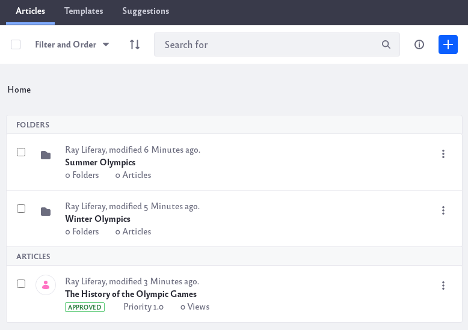
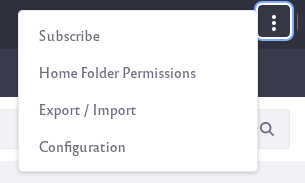

# Managing the Knowledge Base

Users can manage the Knowledge Base from the Knowledge Base app. To navigate to the app, click on the Menu icon () and navigate to *Content and Data* &rarr; *Knowledge Base.*

<!-- Do we need a note about permissions on every article?
Note: To access Knowledge Base in Site Administration, a Role must have the permission *Knowledge Base* &rarr; Access in *Site Administration*. To add or act on articles, folders, or suggestions, the site administrator must grant the appropriate permissions using the Permissions window in Knowledge Base. -->

## Setting the Knowledge Base’s Options

At the top-right of the Knowledge Base app, the Options menu () contains different options,

**Subscribe:** Get notified when Knowledge Base articles are created, updated, or deleted.

**Home Folder Permissions:** Define detailed permissions for the Knowledge Base app. You can choose the Roles that can perform the following tasks,

* Add/delete articles, folders, and templates
* Change the Knowledge Base app’s permissions
* Subscribe to articles
* View templates and suggestions

**Export/Import:** Export or import the Knowledge Base app’s configuration.

**Configuration:** Configure email notifications for article subscriptions and suggestions. You can also make the Knowledge Base app’s articles available via RSS (enabled by default), and configure the RSS feed’s options.

## Managing Knowledge Base Articles

Each article also has a priority value that determines its position in the [Knowledge Base Display widget’s navigation](knowledge-base-display-widget.md). Each article’s priority value appears beneath the article’s title. The Knowledge Base Display widget’s navigation arranges articles in ascending priority. Priority 1 is the highest priority. The higher an article’s priority, the higher it appears in the navigation. Articles are assigned the next lowest priority by default. This behavior can be changed via [Knowledge Base System Settings](knowledge-base-system-settings.md).

To assign articles a new priority value, 

1. Select *Move* from the Actions menu () next to the article.

1. Enter a new priority value for the article.

1. Click *Move* to apply the new priority.

To organize articles with folders,

1. Click the Add icon () and select *Folder*. This opens a form for creating the new folder.

1. Enter a name and an optional description.

    By default, anyone can view the folder. You can manage this setting along with the other permissions in the form’s *Permissions* section.

1. Click *Save*. The folder is then listed in a table in the Articles tab.

The text immediately below the *Filter and Order* selector at the top of the app shows your position in the folder hierarchy. Click a folder’s name in the hierarchy to navigate to it. You can also move articles into folders and create child articles. Knowledge Base also supports nested folders.

Each folder’s Actions menu () lets you perform the following actions,

**Edit:** Change the folder’s name and description.

**Move:** Relocate the folder under a new parent folder or update its priority.

**Delete:** Remove the folder and its articles from the Knowledge Base.

**Permissions:** Grant or revoke the following permissions: add an article to the folder, add a sub-folder to the folder, delete the folder, move the folder, set permissions on the folder, edit (update) the folder, and view the folder.

You can also delete multiple articles or folders at once. To do this, select the checkbox for each item that you want to delete and click the X button that appears in the Management Bar. You can also see the info for selected items by clicking the Info icon () in the Management Bar.