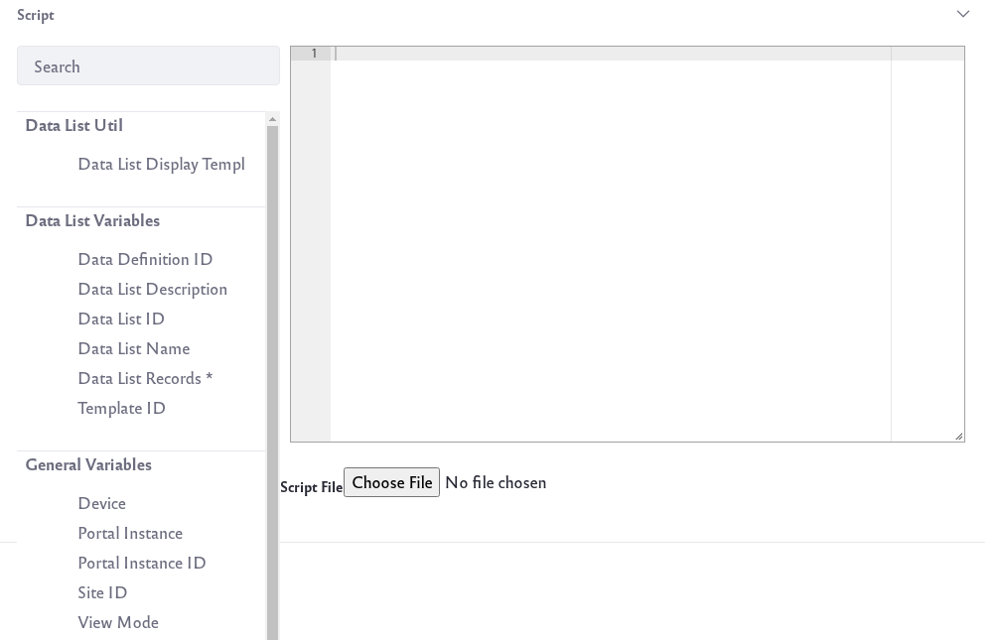

# Creating Display Templates

For every data definition, you can create as many displays as you need. If you’ve created a form template that doesn’t show all the fields of a particular data definition in the data list’s form view, you probably don’t want to display those fields in the list view, either. Modify the list view using Display Templates.

Note: If you’re familiar with [web content templates](../../../content-authoring-and-management/web-content/web-content-templates/creating-web-content-templates.md), display templates customize the display of a list in the same way. Display templates are written in FreeMarker or Velocity, pulling data from the data definition in the same way that web content templates pull data from their structures. Also similar to web content templates, display templates can be embedded in other display templates. This allows for reusable code, JavaScript library imports, or macros imported by Velocity or FreeMarker templates in the system. Embedding display templates provides a more efficient process when you have a multitude of similar data definitions. Just import an embedded display template and work off of it for your new display template.

As with [form templates](./creating-form-templates.md), you can create display templates from Site Administration or the Dynamic Data Lists Display widget. 

To create a new display template from Site Administration,

1. Navigate to *Content & Data* &rarr; *Dynamic Data Lists*. 

1. Click the Options icon () at the top-right and click *Manage Data Definitions*.

1. In the list of data definitions click the definition's Actions icon () and click *Manage Templates*.

1. Click the *Add* icon () and click *Add Display Template*.

1. Give the template a name, expand the Details section of the form, and give it a description. Also in the details section of the form, select the templating language to use from the Language selector. You can choose [FreeMarker](https://freemarker.apache.org/index.html) or [Velocity](https://velocity.apache.org/).

1. In the Script section of the form, create your template in the editor using the templating language you chose in the previous step. The palette to the left of the editor contains common variables. Click a variable to insert it in the editor. The editor also autocompletes. In a FreeMarker template, type `${`, which opens an autocomplete list of common variables. Select a variable to insert it in the editor. Alternatively, you can upload a complete script file by clicking the *Choose File* button below the editor.

    

    See below to learn more about helper variables for the template editor.

1. Click *Save* when you're done creating the template. 

Alternatively, you can create display templates from the Dynamic Data Lists Display widget:

1. Follow the instructions in the [Creating Data List](./creating-data-lists.md) article for adding and configuring the widget in a Site page. Make sure to configure the widget to show the list you’re creating a template for.

1. Click the widget’s *Add Display Template* link. This opens the same form as above for creating a form template for the list’s definition.

## Display Template Editor

Helper variables are available in the template editor. These provide access to most of the data that you’ll use in creating Display Templates. The variables under the heading Data List Variables let you inject specific information about the data definition the template is being created for:

**Data Definition ID:** `reserved_ddm_structure_id`

**Data List Description:** `reserved_record_set_description`

**Data List ID:** `reserved_record_set_id`

**Data List Name:** `reserved_record_set_name`

**Template ID:** `reserved_ddm_template_id`

Inside a template, these variables give the ID for the record set as well as the name, description, and data definition.

Display the list of records by retrieving them and assigning them to the handy `records` variable. Retrieve the list's records from `DDLDisplayTemplateHelper`, which contains these functions:

    getDocumentLibraryPreviewURL

    getHTMLContent

    getLayoutFriendlyURL

    getRecords

    renderRecordFieldValue

`DDLDisplayTemplateHelper` performs common tasks. Use the `getRecords` method to access a data definition's entries and assign them to a `records` variable: 

    <#assign records = ddlDisplayTemplateHelper.getRecords(reserved_record_set_id)>

This fetches the records of the associated data list. You haven’t done anything with them yet, so your display is still empty. To list all the records, use the Data List Records helper in the sidebar of the template editor. Remember to place your cursor in the proper place in the template editor window, then click Data List Records. This code appears at the cursor:

    <#if records?has_content>
        <#list records as cur_record>
            ${cur_record}
        </#list>
    </#if>

This default code snippet spits out everything in the database for the given data definition, which is not very human readable:

    {uuid=52c4ac1c-afe7-963c-49c6-5279b7030a99, recordId=35926, groupId=20126, companyId=20099, userId=20139, userName=Test Test, versionUserId=20139, versionUserName=Test Test, createDate=2018-07-26 14:31:51.056, modifiedDate=2018-07-26 14:31:51.058, DDMStorageId=35927, recordSetId=35922, recordSetVersion=1.0, version=1.0, displayIndex=0, lastPublishDate=null}

Here’s a simple example template that uses a list based on the embedded Contacts data definition, and only displays the Company Name and Email fields in a bulleted list:

    <#assign records = ddlDisplayTemplateHelper.getRecords(reserved_record_set_id)>

    <h1>Here are contacts by company name and email address.</h1>

    <#if records?has_content>
        <#list records as cur_record>
            <ul>
                <li>
                    <#-- The below gets the Company field and wraps it in an <em> tag -->
                    Company Name: <em>${ddlDisplayTemplateHelper.renderRecordFieldValue(cur_record.getDDMFormFieldValues("company")?first, locale)}</em>  
                    <#-- The below gets the Email field  and wraps it in an <em> tag --> 
                    Email: ${ddlDisplayTemplateHelper.renderRecordFieldValue(cur_record.getDDMFormFieldValues("email")?first, locale)} 
                </li> 
            </ul> 
        </#list> 
    </#if>

Here’s what it looks like:

