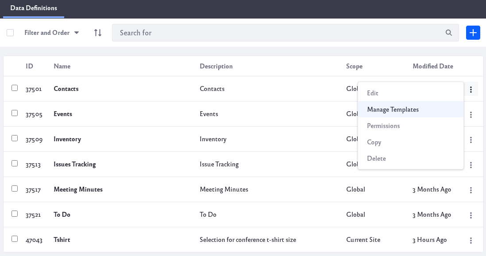

# Using Templates to Display Forms and Lists

After creating data definitions and lists, you can control how the form appears to users, and how the resulting list of records is displayed. This is done by creating templates for each view (form templates for displaying the form and display templates for displaying the list of records). For example, you might need to create a form with a subset of a data definition's fields. Rather than creating a new definition, you can create a template that displays only the fields you want from the existing definition. You could also use a template to arrange fields differently, and/or with different labels and configuration options.

Data definitions can have as many form and display templates as you care to create. You then choose a list's template in the Dynamic Data Lists Display widget.

## Managing Display and Form Templates

Since Display and Form Templates correspond to a particular data definition, they're accessed from the Data Definitions screen of the Dynamic Data Lists application in Site Administration. See the [Creating Data Definition](./creating-data-definitions.md) article for instructions on accessing this screen.

The Data Definitions screen lists each definition in a table. To start working with a definition's templates, click the definition's Actions icon () and click *Manage Templates*. This opens a screen that lists the definition's templates. You can edit, copy, delete, or configure permissions for a definition via its Actions icon ().

Learn more about [Creating Form Templates](./creating-form-templates.md) and [Creating Display Templates](./creating-display-templates.md). 