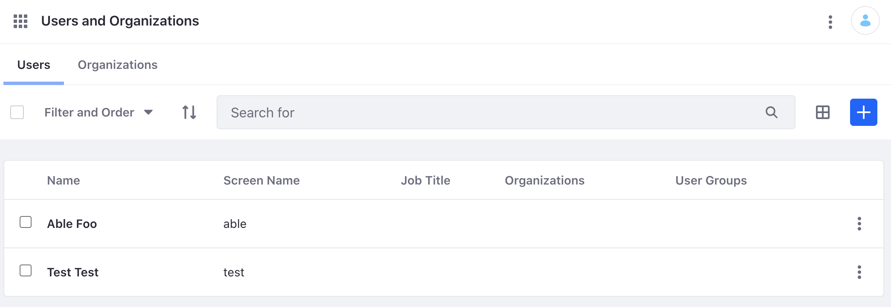

# User Account API Basics

[Adding and managing Users](../users/adding-and-managing-users.md) can be done from the Control Panel but it can also be done using Liferay's REST APIs. Curl commands and Java classes can be used to add, edit, delete Users.

Let's start with an example for adding a new User.

## Adding Users

1. Start Liferay DXP. If you don't already have a docker container, use

    ```bash
    docker run -it -p 8080:8080 [$LIFERAY_LEARN_DXP_DOCKER_IMAGE$]
    ```
1. Download and unzip [User Account API Basics](./liferay-y6q4.zip).

    ```bash
    curl https://learn.liferay.com/dxp/latest/en/users-and-permissions/developer-guide/liferay-y6q4.zip -O
    ```

    ```bash
    unzip liferay-y6q4.zip
    ```

    Here's the project's folder structure:

    ```
    liferay-y6q4.zip/
    ├── curl // curl command scripts
    └── java // Java classes
    ```

1. Use the curl script to add a new User to your Liferay instance. On the command line, navigate to the `curl` folder. Execute the `User_POST_ToInstance.sh` script.

    ```bash
    ./User_POST_ToInstance.sh
    ```

    The JSON response shows a new User has been added:

    ```bash
    {
        "additionalName" : "",
        "alternateName" : "able",
        "birthDate" : "1977-01-01T00:00:00Z",
        "customFields" : [ ],
        "dashboardURL" : "",
        "dateCreated" : "2021-05-19T16:04:46Z",
        "dateModified" : "2021-05-19T16:04:46Z",
        "emailAddress" : "able@liferay.com",
        "familyName" : "Foo",
        "givenName" : "Able",
        "id" : 39321,
        "jobTitle" : "",
        "keywords" : [ ],
        "name" : "Able Foo",
        "organizationBriefs" : [ ],
        "profileURL" : "",
        "roleBriefs" : [ {
            "id" : 20113,
            "name" : "User"
        } ],
        "siteBriefs" : [ {
            "id" : 20127,
            "name" : "Global"
        }, {
            "id" : 20125,
            "name" : "Guest"
        } ],
        "userAccountContactInformation" : {
            "emailAddresses" : [ ],
            "facebook" : "",
            "jabber" : "",
            "postalAddresses" : [ ],
            "skype" : "",
            "sms" : "",
            "telephones" : [ ],
            "twitter" : "",
            "webUrls" : [ ]
        }
    }%   
    ```

    In Control Panel, verify the newly added User. Note the User's `id` number for later commands.

    

1. The API call can also be made with a Java class. Navigate out of the `curl` folder and into the `java` folder. Compile the source files with the following command:

    ```bash
    javac -classpath .:* *.java
    ```

1. Run the `User_POST_ToInstance` class with the following command:

    ```bash
    java -classpath .:* User_POST_ToInstance
    ```

    Verify in Control Panel that another User has been added.

    

Now let's take a closer look at the curl command and Java class.

## API CURL Command

The `User_POST_ToInstance.sh` script calls the REST service with a curl command. 

```bash
curl \
	-H "Content-Type: application/json" \
	-X POST \
	"http://localhost:8080/o/headless-admin-user/v1.0/user-accounts" \
	-d "{\"alternateName\": \"Able\", \"emailAddress\": \"able@liferay.com\", \"familyName\": \"Foo\", \"givenName\": \"Able\"}" \
	-u "test@liferay.com:test"
```

Here are the command's arguments:

| Arguments | Description |
| --------- | ----------- |
| `-H "Content-Type: application/json"` | Indicates that the request body format is JSON. |
| `-X POST` | The HTTP method to invoke at the specified endpoint. |
| `"http://localhost:8080/o/headless-admin-user/v1.0/user-accounts"` | The REST service endpoint. |
| `-d "{\"alternateName\": \"Able\", \"emailAddress\": \"able@liferay.com\", \"familyName\": \"Foo\", \"givenName\": \"Able\"}"` | The data you are requesting to post. |
| `-u "test@liferay.com:test"` | Basic authentication credentials. |

```note::
   Basic authentication is used here for demonstration purposes. For production, you should authorize users via `OAuth2 <../../../installation-and-upgrades/securing-liferay/configuring-sso/using-oauth2/introduction-to-using-oauth2.md>`_.
```

The other curl commands use similar JSON arguments.

## API Java Class

The `User_POST_ToInstance.java` class adds a User by calling REST service.

```java
public static void main(String[] args) throws Exception {
	UserAccountResource.Builder builder = UserAccountResource.builder();

	UserAccountResource userAccountResource = builder.authentication(
		"test@liferay.com", "test"
	).build();

	UserAccount userAccount = userAccountResource.postUserAccount(
		new UserAccount() {
			{
				alternateName = "Baker";
				emailAddress = "baker@liferay.com";
				familyName = "Foo";
				givenName = "Baker";
			}
		});

	System.out.println(userAccount);
}
```

The class calls the REST service with only three lines of code:

| Line (abbreviated) | Description |
| ------------------ | ----------- |
| `UserAccountResource.Builder builder = ...` | Gets a `Builder` for generating a `UserAccountResource` service instance. |
| `UserAccountResource userAccountResource = builder.authentication(...).build()` | Specified basic authentication and generates a `UserAccountResources` service instance. |
| `UserAccount userAccount = userAccountResource.postUserAccount(...)` | Calls the `userAccountResource.postUserAccount` method and passes the data to post. |

```note::
   The ``main`` method's comment demonstrates running the class.
```

The other example Java classes are similar to this one but call different `userAccountResource` methods.